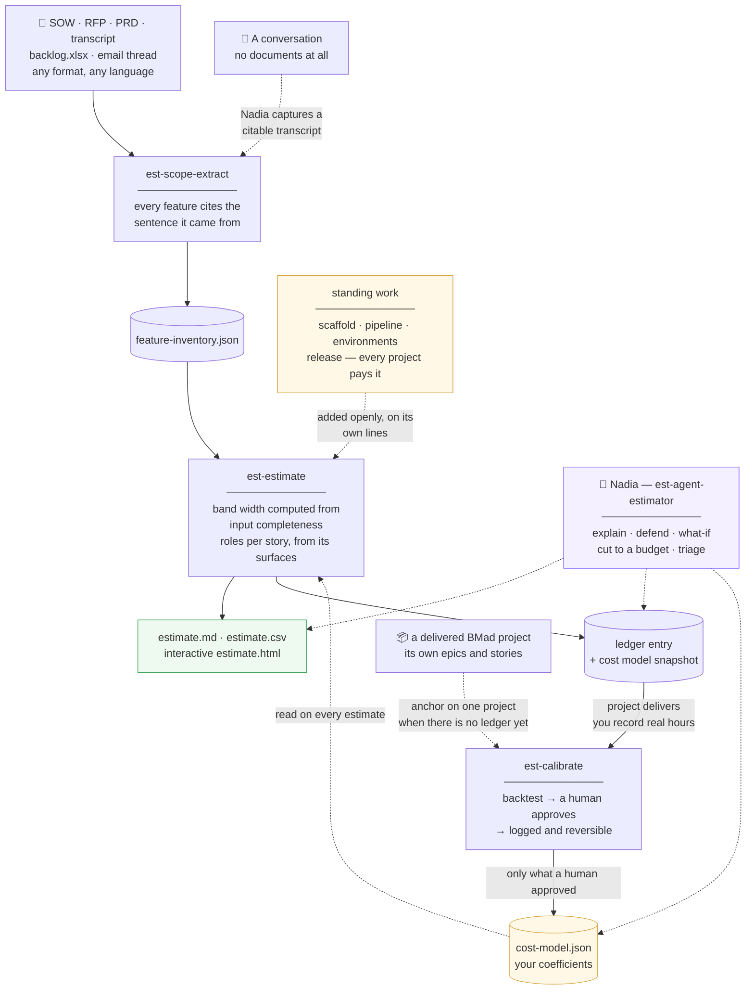

# BMad Delivery Estimator

Turn whatever the client actually sent you — a 60-page SOW, a call transcript, a spreadsheet of half-written features — into an hour estimate you can defend line by line.

Built for outsourcing teams delivering with the [BMad method](https://github.com/bmad-code-org), where an agent writes most of the code and the human cost moves to specifying, reviewing and correcting it. That shift breaks pre-BMad estimating intuition, and this module encodes what replaces it.

---

## What it actually does

You point it at documents. It reads them, pulls out the features, and prices them — and every hour in the output traces back to a sentence in the client's own document.

Three properties make it different from a spreadsheet:

**The range is computed, not chosen.** Band width comes from an *input completeness score*: how much the source documents actually said. Two paragraphs of discovery notes cannot produce a ±10% number, because the arithmetic won't allow it. If you want a tighter estimate, the tool hands you the three questions that would earn it.

**Nothing is invented and nothing is silently dropped.** Every extracted feature carries a verbatim quote from its source. Every substantive passage that *didn't* become a feature is listed with a reason. Both directions are checked mechanically by re-opening the documents — not asserted.

**Every task is priced per role, and only the roles actually on it.** Each story declares the surfaces it touches — backend, frontend, design, infra, data — and roles whose surface is absent are dropped from that story entirely. A nightly reconciliation job bills no designer. The shares renormalise, so the story still costs what it costs; the hours just land on the people doing the work. The architect appears only in project-level components, because the tech lead does not review individual stories.

**The coefficients are fitted to a delivered project, and it says so.** The shipped model is calibrated against EPP Phase 1 — 76 stories, 540 hours, split across six roles — which re-prices to 569h, within 5%. That is one project, `calibration_history` records `n=1`, and every rendered estimate carries the sample size. One project is far better than a reasoned guess and is not a trend; the module never lets you confuse the two.

**It learns from what you actually delivered.** When a project closes, you record the real hours. The calibrator backtests any proposed coefficient change against your delivery history and shows you "this would have improved 7 of your last 9 estimates" before you approve it. Nothing changes the model without a named human agreeing to it. **One delivered BMad project is enough to start** — it reads that project's own epics and stories for its shape, and stamps the resulting change `n=1` so nobody mistakes it for a trend.

### The one modelling idea worth understanding

**Review effort scales with the volume of code produced, not the time taken to produce it.**

Under BMad, the agent writes roughly the code a human would have written, in a fraction of the time. So compression collapses the *build* and leaves the *review* untouched. That single choice reproduces what teams actually experience — no special-casing needed.

Two stories, both sized M, both an 11.7-hour manual baseline:

| | Build | Review | **Total** |
|---|---|---|---|
| CRUD screen — compresses well, routine review | 0.8h | 0.5h | **2.4h** |
| Payments flow — compresses badly, line-by-line review | 2.7h | 3.8h | **8.1h** |

Same size. 3.4× the cost. On the payments story review now *exceeds* build, and BMad's speed advantage has mostly evaporated — which is exactly the deal you want to know about before you win it.

---

## How the pieces fit together



The loop at the bottom is the point: every delivered project makes the next estimate better, and the arrow into `cost-model.json` only ever moves when a human approves it.

---

## Install

This is a **BMad module**, so it installs through the BMad installer into a BMad project.

```bash
npx bmad-method install
```

Answer the prompts as usual, and when it asks:

```
Do you want to install custom or community modules (Git URL or local path)?
> Yes

Git URL or local path:
> https://github.com/Relevant-S/bmad-est
```

The installer clones the repo, reads `.claude-plugin/marketplace.json`, and offers:

```
  BMad Delivery Estimator v1.0.0
  Turns any project input — transcript, PRD, SOW, RFP or backlog workbook,
  in any format or language — into a traceable scope inventory and a
  defensible, ranged hour estimate for delivery with the BMad method.

Select modules to install:
  ◉ BMad Delivery Estimator v1.0.0 (5 skills)
```

Tick it and finish the install. The installer writes the module's settings into `_bmad/config.toml`, merges its capabilities into the help catalog, and registers Nadia in the agent roster.

Then, in your project:

```
run est-setup
```

The installer registers the module; `est-setup` prepares what the module *runs on* — it scaffolds the shared memory at `_bmad/memory/est/`, seeds `cost-model.json` from the versioned default, creates the ledger and the files calibration appends to, and reports which document converters are missing. It also re-writes your settings into `_bmad/custom/config.toml`, the layer the installer never regenerates, so a later reinstall can't reset them.

It is safe to run again at any time — every write is anti-zombie, and it will never overwrite a `cost-model.json` that already exists, because that file becomes yours the moment calibration touches it.

**Two things setup can't do, and both matter more than any setting:**

1. **Run the company profile interview.** Ask Nadia. Five minutes, and it stops your estimates being priced against industry averages instead of your teams. Generic coefficients on the first number is the fastest way to lose trust in the tool.
2. **Calibrate.** The seed cost model is `UNCALIBRATED`: the *shape* of an estimate is defensible on day one, the absolute hours are a reasoned hypothesis until real actuals have moved them.

### Installing from a local clone

Useful when you're changing the module and want the changes live in a project:

```bash
git clone https://github.com/Relevant-S/bmad-est.git
npx bmad-method install     # answer the Git-URL prompt with /path/to/bmad-est
```

A local source points at the directory directly, so your edits take effect on the next reinstall rather than needing a push.

### Also installable as a Claude Code plugin

The same manifest works with Claude Code's plugin system, if you want the skills without the BMad module registration:

```bash
claude plugin marketplace add Relevant-S/bmad-est
claude plugin install bmad-est@bmad-est
```

Note this route installs the *skills* but does not run `est-setup`, so BMad config and the shared memory at `_bmad/memory/est/` still need `run est-setup` before your first estimate.

---

## Your first estimate

```
extract scope from ./client-docs/
```

Reads every file in the folder, produces `feature-inventory.json`, and shows you a coverage report — what it found, what it deliberately didn't treat as scope, and what the documents failed to say. **Review this before pricing it.** A wrong inventory produces a confident wrong number, and this review is where invented scope gets caught.

```
estimate it
```

Produces the range, split by BMad phase (`planning`, `planning-review`, `spec`, `build`, `review`, `rework`, `qa`, `overhead`), by role (`dev`, `devops`, `qa`, `ba`, `ux`, `architect`) **and by role per story**, plus a ledger entry that snapshots the exact coefficients used.

It also adds the work no client document describes — repo scaffold, pipeline, environments, release process — from the cost model's `standing_work` catalogue. Those appear as their own labelled lines with their own total, never folded into the number silently. `--no-standing-work` drops the block when the client is bringing a platform that already has it.

```
talk to Nadia
```

Then ask her things a spreadsheet can't answer:

- *"Why is the payments feature four times the settings screen?"*
- *"The client says this should be half — where's the actual give?"*
- *"What if we drop the pricing engine?"* — she re-prices it properly. On a worked example, dropping a story worth **92.9h** of its own effort changed the project by **117.1h**, because QA, overhead and planning all scale with what remains. Quoting the story's own hours would have been wrong by a quarter, in the direction that sounds plausible. She also reports where the saving lands by role — on that cut, `dev −83.3h`, `qa −16.9h`, `devops 0.0h`.
- *"What fits in 600 hours?"* — a cut line where every figure is a genuine re-price, ordered to disturb as little as possible, with anything the budget didn't actually need put back.
- *"Play the client and attack this number."*

---

## The five skills

| Skill | What you say | What you get |
|---|---|---|
| **est-scope-extract** | *"extract scope from this RFP"* | Epics → stories → the source rows each was built from, every one citing its own line, plus an explicit list of what wasn't treated as scope |
| **est-estimate** | *"estimate this"* / *"quick gut-check"* | Ranged hours split by phase and by role, per story; markdown, CSV, and an interactive HTML report |
| **est-agent-estimator** (Nadia) | *"talk to Nadia"* | Explanation, defence, what-ifs, cut lines, portfolio triage, cost-model curation |
| **est-calibrate** | *"how accurate are our estimates?"* | Accuracy report; backtested, human-approved coefficient changes — or an anchor fitted to one delivered project |
| **est-setup** | *"install the estimator"* | Config, seeded memory, registered capabilities |

Every skill runs standalone and headless (`-H`) except Nadia — batch twenty presale extractions overnight, and let a human triage the ones that need attention in the morning.

### The interactive report

`estimate.html` is self-contained and shareable. Untick a feature and the whole range recomputes live — including the project overheads that shrink with it. Open it in the client call and *"your number is too high"* becomes *"which of these do you want"*.

---

## Where things live

```
_bmad/memory/est/               ← shared by all five skills
├── cost-model.json             ← your coefficients. Every one carries a `why`.
├── company-profile.md          ← your teams, stacks, QA setup
├── comparables.md              ← past projects: estimated vs actual
├── calibration-log.md          ← every coefficient change and how to reverse it
└── ledger/                     ← one entry per estimate, with its model snapshot

{output_folder}/estimates/{project}/
├── feature-inventory.json      ← epics → stories → the source rows behind each
├── estimate.json               ← the full estimate, with per-story role splits
├── estimate.md / .csv / .html  ← the shareable renders
└── normalized/                 ← converted sources, so citations stay verifiable
```

**The set of output files is declared, not emergent.** `skills/est-setup/assets/module-outputs.yaml` names every path each skill writes and the condition under which the optional ones appear; `check-outputs.py` reports anything missing or undeclared. A folder nobody can read as a set of *current* artefacts is how a leftover from an interrupted run ends up quoted at a client.

**The cost model is a data file, not code.** Open it, read it, argue with it. There is no coefficient in this module that a human can't interrogate — and the two ways to change it (`est-calibrate` for evidence, `curate.py` for judgement) both back up, log, and stay reversible.

---

## Configuration

Ten settings, written by `est-setup` to `_bmad/custom/config.toml`:

| Setting | Default | What it does |
|---|---|---|
| `est_output_folder` | `{project-root}/_bmad-output/estimates` | Where estimates are written |
| `est_default_fidelity` | `presale` | `quick` for a go/no-go, `delivery` for scope inside a running project |
| `est_default_team_profile` | `balanced` | Assumed when nobody knows who'll do the work |
| `est_output_formats` | `md, csv, html` | What gets rendered |
| `est_show_manual_baseline` | `false` | Internal pre-BMad comparison; usually off for client output |
| `est_report_calendar_duration` | `true` | Derived elapsed weeks, always secondary to hours |
| `est_roles` | `architect, dev, devops, qa, ba, ux` | No PM — the Architect absorbs it during planning, and appears only on project-level work |
| `est_min_calibration_samples` | `3` | Delivered projects before a pattern beats a weak signal |
| `est_sprint_length_days` | `10` | For delivery-mode capacity fitting |
| `est_knowledge_pack_source` | *(blank)* | Shared cost model location; blank = local only |

**No rates, no currency, no margin.** The module outputs hours split by role and nothing more. Pricing stays with your sales team.

---

## Getting it to compound

Everything else in this module is worth less than this: **when a project closes, record its actual hours.**

```
record actuals for EST-20260907-acme-portal
```

Three fields decide whether a project can be compared at all, and all three are questions for a human:

- **Scope delivered** — an estimate for ten features against actuals for seven delivered ones isn't evidence, and averaging it in teaches the model something untrue.
- **Excluded hours, with a reason** — time sheets are full of waiting on clients and paused months. Leaving that in makes the estimator look pessimistic and drives every coefficient the wrong way.
- **Confidence** — a PM's recollection shouldn't move a coefficient as hard as a time-tracking export.

A single project total with those three fields is enough to start calibrating band width and overall sizing. Per-feature hours unlock review tier and compressibility — the module's core IP — but the ask is deliberately small, because a calibrator that demands story-level time tracking never gets run.

---

## Requirements

- **A BMad project.** The module reads BMad's config resolver and writes into its help catalog.
- **Python 3.11+** and [`uv`](https://docs.astral.sh/uv/). Most scripts are stdlib-only; `uv run` handles the rest.
- **Document converters** (optional): `markitdown`, `openpyxl`, `python-docx`, `pypdf`, `pdftotext`. Without them extraction still works — it falls back to reading each source natively, which is slower and loses spreadsheet row anchors. `est-setup` checks what's present.

---

## Development

```bash
# All suites (520 tests). Run through uv: est-setup's config tests need Python
# 3.11 for tomllib, the same requirement BMad's own config resolver carries.
# -B matters too: macOS Python caches bytecode centrally, where a same-length
# edit within one second can defeat cache invalidation and run stale code.
for d in skills/*/scripts/tests; do
  for f in "$d"/test-*.py; do
    (cd "$d" && uv run --python 3.11 --with pyyaml python -B "$(basename "$f")")
  done
done

# Validation by recovery: perturb the cost model, generate actuals from the
# perturbed version, and assert the calibrator recovers the bias — and equally
# that it proposes nothing when there is nothing to find.
python3 -B skills/est-calibrate/evals/ground-truth.py

# The interactive report recomputes the estimate in the browser, which means two
# implementations of one model. This executes both and compares them.
uv run skills/est-estimate/scripts/check-parity.py <workspace>/estimate.json

# Adversarial whole-inventory shapes: a thin brief cannot look certain, compression
# does not rescue a sensitive feature, adding people cannot beat a dependency chain.
uv run skills/est-estimate/evals/run-cases.py

# Every file the module writes is declared. This names anything missing from a
# workspace, or present in it that nothing declared.
uv run skills/est-setup/scripts/check-outputs.py --skill est-estimate --workspace <dir>

# A cost model from before schema 2.0 prices overhead as a share of scope and has no
# surfaces. This converts it, keeping every calibrated value it can and saying plainly
# which sections changed shape and had to be reset.
uv run skills/est-estimate/scripts/migrate-cost-model.py _bmad/memory/est/cost-model.json --in-place
```

Design notes, the full cost model specification, and the build history live in [`skills/reports/estimation-module-plan.md`](skills/reports/estimation-module-plan.md).

---

## License

ISC
